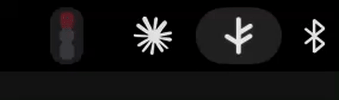
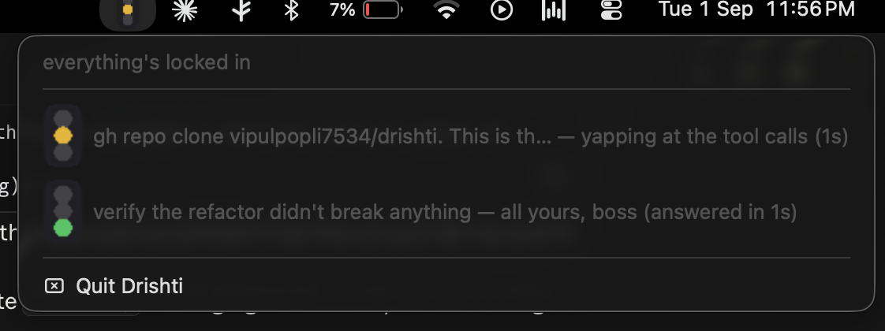

# Drishti

*दृष्टि — sight, the act of seeing.*

A menu-bar traffic light for [Claude Code](https://code.claude.com) sessions. Named after the
*divya drishti* granted to Sanjaya in the Mahabharata, so he could watch the war at Kurukshetra
from far away and relay it to a king who couldn't see it himself. That's the product: work is
happening in a terminal you're not looking at, and Drishti gives you sight of it.





## The problem

When you run a long Claude Code task and context-switch away, two things go wrong:

1. **Silent blocking.** Claude hits a permission prompt or asks a clarifying question and just
   sits there. You don't notice for ten minutes.
2. **Silent completion.** The task finishes and you don't know, so you keep polling the
   terminal or forget about it entirely.

Both are the same failure: no ambient signal for *whose turn it is*. Drishti is a traffic light,
glanceable from across the desk, that answers "is it my move or Claude's?"

## The states

| Light | Meaning |
|---|---|
| 🔴 Red | Blocked on you — a permission prompt, a clarifying question, an `AskUserQuestion` waiting for a choice. |
| 🟡 Yellow | Claude is running — thinking or executing tools. |
| 🟢 Green | Turn ended cleanly, the work is back with you. |

The menu-bar icon shows the **aggregate** across every tracked session — red beats yellow beats
green, so if *anything* needs you, the icon tells you at a glance. Click it for a per-session
breakdown, each labeled by its first prompt (or its project directory if none has landed yet).

## How it works

Claude Code emits [lifecycle hook events](https://code.claude.com/docs/en/hooks) — session
start/end, tool calls, permission requests, notifications, turn completion. A tiny shell shim
(`hook-shim/drishti-hook.sh`) forwards each event to a local daemon, which runs a small state
machine per session and renders the result as a native macOS tray icon.

```
Claude Code session → hook event → drishti-hook.sh → localhost daemon → state machine → tray icon
```

The daemon is entirely local: no network calls, no accounts, no telemetry. It's an Electron app
mainly because Electron makes a cross-platform tray icon trivial — there's no browser window.

## Setup

```bash
git clone https://github.com/vipulpopli7534/drishti.git
cd drishti
npm install
npm run build
```

**Run it in development** (keeps running in your terminal):

```bash
npm start
```

**Or build a real double-clickable app (preferable):**

```bash
npm run package:mac
cp -R release/mac-arm64/Drishti.app /Applications/
open /Applications/Drishti.app
```

### Wiring up the hooks

Drishti only lights up once Claude Code is actually telling it what's happening. Add this to
your **global** `~/.claude/settings.json` (global, not per-project — the whole point is seeing
every session on the machine), pointing `command` at wherever you cloned this repo:

```json
{
  "hooks": {
    "SessionStart":   [{ "matcher": "", "hooks": [{ "type": "command", "command": "/path/to/drishti/hook-shim/drishti-hook.sh", "async": true, "timeout": 2 }] }],
    "UserPromptSubmit": [{ "matcher": "", "hooks": [{ "type": "command", "command": "/path/to/drishti/hook-shim/drishti-hook.sh", "async": true, "timeout": 2 }] }],
    "PreToolUse":     [{ "matcher": "", "hooks": [{ "type": "command", "command": "/path/to/drishti/hook-shim/drishti-hook.sh", "async": true, "timeout": 2 }] }],
    "PostToolUse":    [{ "matcher": "", "hooks": [{ "type": "command", "command": "/path/to/drishti/hook-shim/drishti-hook.sh", "async": true, "timeout": 2 }] }],
    "PermissionRequest": [{ "matcher": "", "hooks": [{ "type": "command", "command": "/path/to/drishti/hook-shim/drishti-hook.sh", "async": true, "timeout": 2 }] }],
    "Notification":   [{ "matcher": "", "hooks": [{ "type": "command", "command": "/path/to/drishti/hook-shim/drishti-hook.sh", "async": true, "timeout": 2 }] }],
    "Stop":           [{ "matcher": "", "hooks": [{ "type": "command", "command": "/path/to/drishti/hook-shim/drishti-hook.sh", "async": true, "timeout": 2 }] }],
    "SessionEnd":     [{ "matcher": "", "hooks": [{ "type": "command", "command": "/path/to/drishti/hook-shim/drishti-hook.sh", "async": true, "timeout": 2 }] }]
  }
}
```

If you already have hooks configured for these events, add Drishti's entry to each event's
existing `hooks` array rather than replacing it — Claude Code runs every hook registered for an
event, not just one.

## Making it your own

The quips in the dropdown live in `assets/phrases.json` and are re-read on every click — edit
that file and reopen the dropdown to see your own voice, no rebuild needed.

The "what counts as blocked" logic lives in `src/main/config.ts`:

- `HUMAN_INPUT_TOOL_NAMES` — tool names that block the moment they're invoked (e.g.
  `AskUserQuestion`), since there's no further signal until a human responds.
- `BLOCKING_NOTIFICATION_TYPES` / `RESOLVING_NOTIFICATION_TYPES` — which `Notification`
  sub-types mean "blocked on you" vs. "you just resolved it."

Adding a new hook event entirely is a one-line addition to the `HOOK_HANDLERS` table in
`src/main/daemon/stateMachine.ts`.

## Development

```bash
npm test          # runs the state machine + session store test suite
npm run build     # type-check and compile
```

## Known limitations

- **Red vs. green is a guess in one specific case.** Claude Code's `Stop` event fires
  identically whether a turn ended because the task is done or because Claude just asked a
  clarifying question. Drishti currently maps `Stop` → green; there's no hook-level signal to
  tell the two apart.
- **macOS only, for now.** The state machine and daemon are platform-agnostic; the hook shim and
  packaging are macOS-specific. A Windows port needs a `.ps1` shim and a Windows
  `electron-builder` target.

## License

BSD 2-Clause — see [LICENSE](LICENSE).
